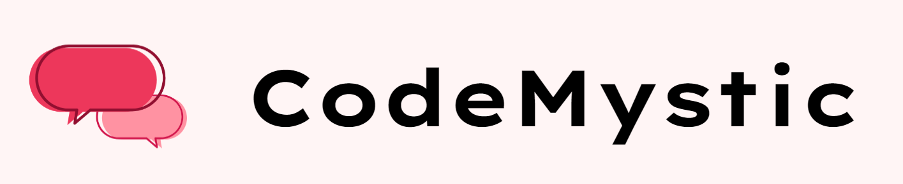
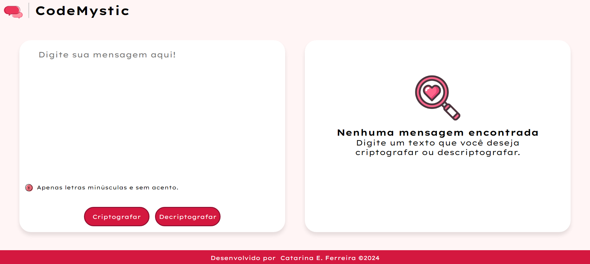

<h1 align="center">
  <a href="https://catarinaeudoxia.github.io/decodificador-alura/" target="_blank">CodeMystic — Decodificador</a>
</h1>

  

## Índice

* [1. Introdução](#1-introdução)
* [2. Requisitos](#2-requisitos)
* [3. Ferramentas e mecanismos usados](#3-ferramentas-e-mecanismos-usados)
* [4. CodeMystic aqui](#4-codemystic-aqui)
* [5. Projeto desenvolvido por](#5-projeto-desenvolvido-por)

## 1. Introdução

Este projeto foi desenvolvido como parte do curso da Alura, representando um dos nossos primeiros desafios no programa. O Decodificador Alura tem como objetivo principal implementar um sistema capaz de seguir as regras estabelecidas pela equipe Alura para codificação e decodificação de mensagens.

Embora o projeto tenha um modelo de design inicial fornecido, os participantes têm liberdade para realizar alterações, visando aprimorar suas habilidades e aplicar os conhecimentos adquiridos durante o curso.

#challengeonedecodificador6

## 2. Requisitos
[✔] Deve funcionar apenas com letras minúsculas

[✔] Não devem ser utilizados letras com acentos nem caracteres especiais

[✔] Deve ser possível converter uma palavra para a versão criptografada e também retornar uma palavra criptografada para a versão original. Por exemplo: "gato" => "gaitober" | "gaitober" => "gato"

[✔] A página deve ter campos para inserção do texto a ser criptografado ou descriptografado, e a pessoa usuária deve poder escolher entre as duas opções

[✔] O resultado deve ser exibido na tela.

[✔] Um botão que copie o texto criptografado/descriptografado para a área de transferência - ou seja, que tenha a mesma funcionalidade do ctrl+C ou da opção "copiar" do menu dos aplicativos.

## 3. Ferramentas e mecanismos usados
— HTML

— CSS

— JavaScript

— VSCODE

— Figma

— Git

# 4. CodeMystic aqui:

  Aproveite e de uma olhadinha no projeto
  <a href="https://catarinaeudoxia.github.io/decodificador-alura/" target="_blank">
    CodeMystic - Decodificador
  </a>!

  

 

# 5. Projeto desenvolvido por:

  <table>
    <tr>
      <td align="center">
        <a href="#">
           
          
            <b>Catarina Eudoxia Ferreira</b>
          
        </a>
      </td>
    </tr>
  </table>

